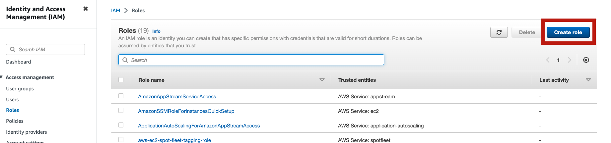
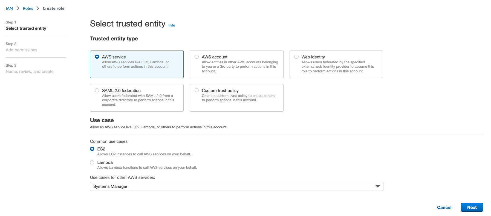
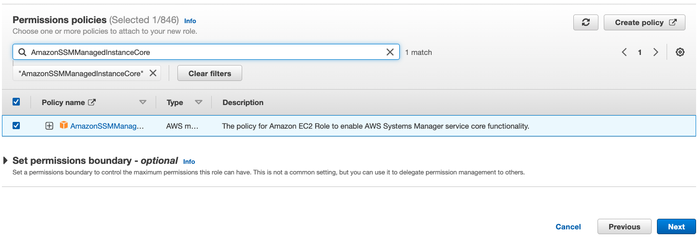
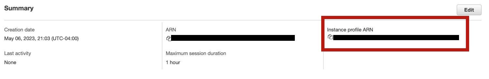

# VectorVisor Evaluation

This subdirectory contains the evaluation materials for the USENIX ATC 2023 paper "VectorVisor: A Binary Translation Scheme for Throughput-Oriented GPU Acceleration".

There are two primary components to our evaluation:
- VectorVisor, the vectorizing binary translator for GPUs (https://github.com/SamGinzburg/VectorVisor)
- Our PGO (profile-guided optimization) instrumentation tool (https://github.com/SamGinzburg/vv-pgo-instrument)

VectorVisor can be built directly from source, although we also offer prepackaged Amazon AWS AMIs for cloud evaluation.

## Building from source (local testing)

### Prerequisites:
1. Ubuntu 18.04 LTS
2. CUDA 12 (NVIDIA driver version 525)
3. OpenCL C development headers & libraries
4. Stable Rust 1.6+

To confirm that the GPU driver and OpenCL setup is complete, run "clinfo" and/or "nvidia-smi", and ensure that "cargo" is in your $PATH.

Examples of how we build VectorVisor from source can be seen in the "make_image.py" script (used to generate AWS AMI images).

## Configuring the cloud environment

Our evaluation is conducted primarily on AWS, using the instances specified in the paper. To replicate our results, a valid AWS account (with an associated credit card or billing) must be configured. The account must also request a quota increase for g4dn.* and g5.* class instances to at least 8 vCPUs for our benchmarks to run. A valid IAM role with permissions to invoke the AWS Systems Manager must be configured before running the benchmarks.

AWS CLI tools must be installed (https://docs.aws.amazon.com/cli/latest/userguide/getting-started-install.html), and "us-east-1" should be set as the default region.

### Configuring the IAM Role

We automate our evaluation using Amazon SSM (Systems Manager), which requires a custom IAM role to be configured before running. The following steps can be performed to create the role for your account:

1. Create a new role by navigating to the IAM AWS service



2. Select the correct entity type (AWS service, EC2, Systems Manager)



3. Enter the role name, and set the correct SSM permission (AmazonSSMManagedInstanceCore)



4. Create the role


5. After the role is created, you can select the role from the list of IAM roles on your account, and obtain the Instance profile ARN. This ARN is the one needed as a CLI argument for the scripts that create AWS AMIs and run the benchmarks.



## Cloud Evaluation

For the USENIX ATC '23 AEC, we provide three precompiled AWS AMIs---with VectorVisor and our PGO tools preinstalled. All benchmarks are precompiled and included in the machine image as well. Precompiled NVIDIA AMIs (e.g., T4 and A10G instances) run Ubuntu 18.04 LTS and precompiled AMD AMI use Amazon Linux.

T4 AMI = ""
A10G AMI = ""
v520 AMI = ""

The throughput and throughput/$ evaluation can be reproduced by running:
```
./run_all.sh <T4 AMI> <A10G AMI> <v520 AMI> <AWS ARN>
```
where the AMI IDs are those given above, and the AWS instance ARN corresponds to the IAM role configured previously. The output will be written to a directory with the current data as the name.
